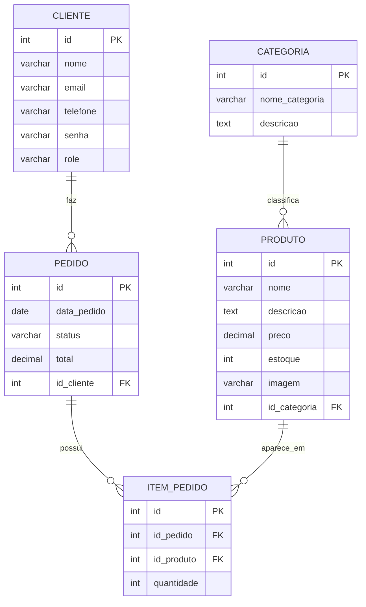
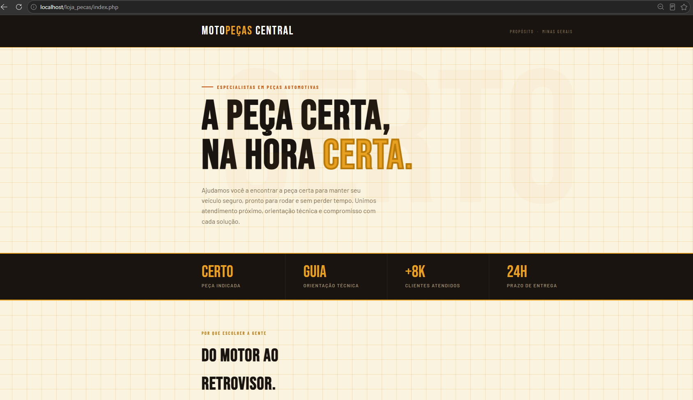
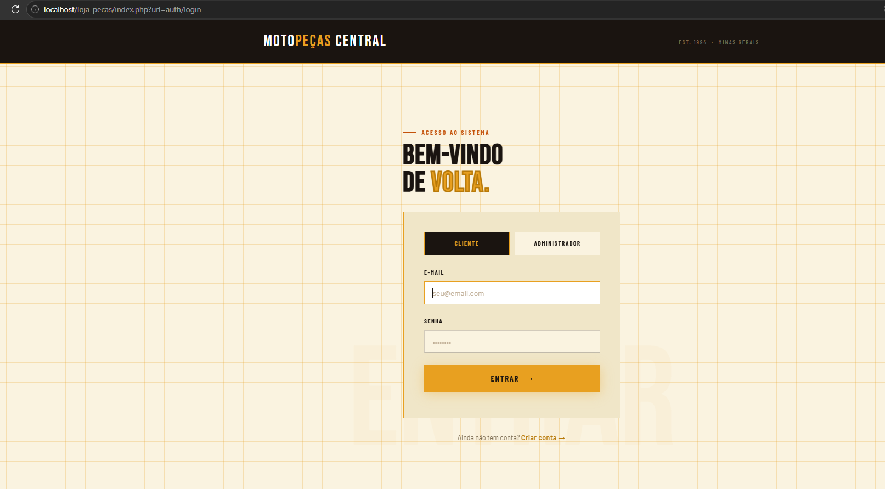
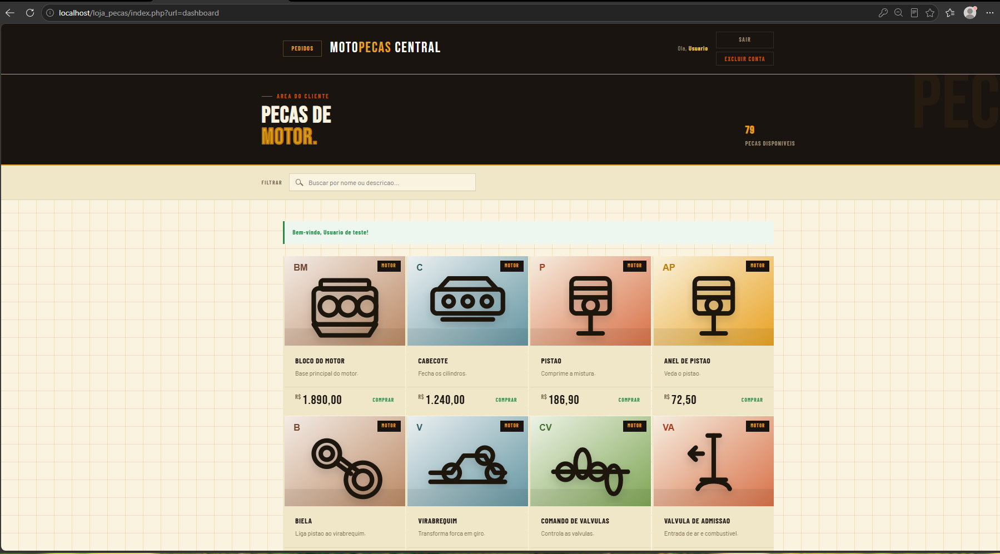
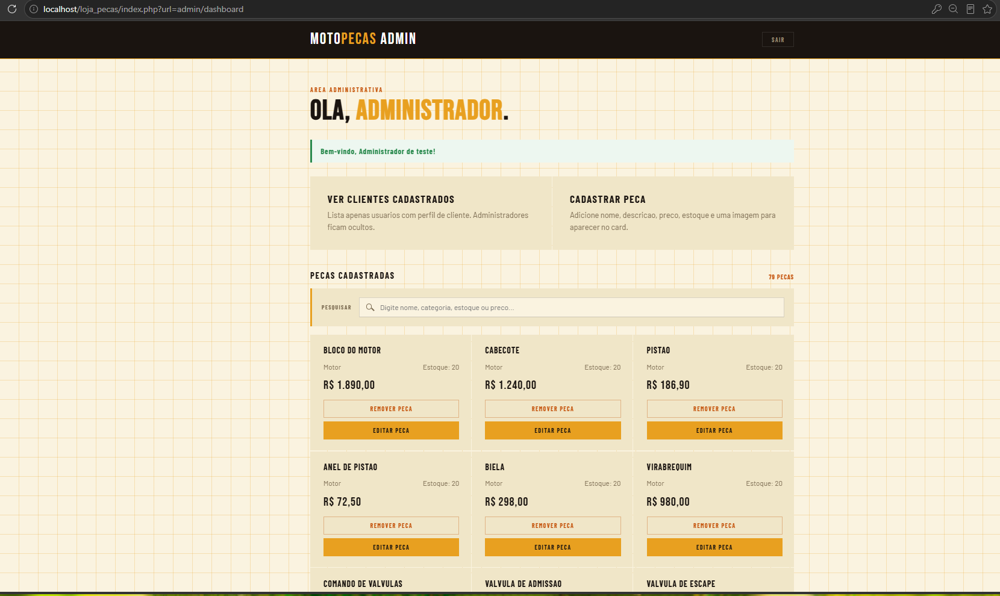
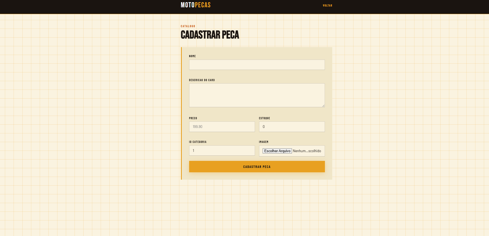
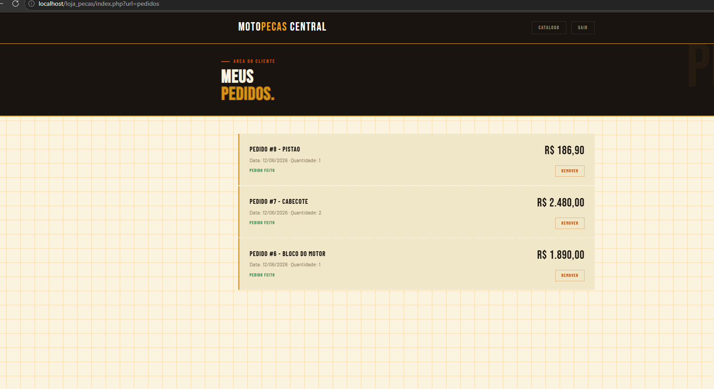

# Loja de Pecas

## Integrante

Vinicius Santos Felix

## Tema da loja

Loja de pecas automotivas, com foco em pecas de motor para motos e veiculos leves.

## Descricao do sistema

O projeto e um sistema web em PHP para uma loja de pecas. O cliente pode se cadastrar, fazer login, navegar pelo catalogo, pesquisar pecas, abrir a tela de compra e acompanhar seus pedidos. O administrador pode acessar uma area propria para gerenciar clientes e pecas cadastradas, incluindo cadastro, edicao, exclusao e pesquisa de pecas na tela administrativa.

O upload/insercao de imagem para uma peca existe na estrutura do formulario e no banco, mas ainda nao esta implementado 100%. Em alguns casos a imagem pode nao aparecer como esperado, por isso essa parte ainda precisa de ajustes finais.

## Tecnologias utilizadas

- PHP
- PDO para conexao com MySQL
- MySQL/MariaDB
- HTML5
- CSS3
- JavaScript
- XAMPP

## Diagrama de classes

O diagrama de classes deve ser colocado na pasta `docs/prints/` com o nome `diagrama-classes.png`.


## Modelo do banco de dados

Modelo principal usado pelo sistema:



Arquivos SQL de apoio:

- `admin/config/migration_catalogo_pedidos.sql`
- `admin/config/migration_catalogo_complementar.sql`
- `admin/config/migration_clientes_senha.sql`
- `admin/config/migration_produto_descricao_imagem.sql`

## Como instalar e executar

1. Copie a pasta do projeto para `C:\xampp\htdocs\loja_pecas`.
2. Inicie o Apache e o MySQL pelo XAMPP.
3. Crie um banco de dados chamado `loja_pecas`.
4. Confira os dados de conexao em `admin/config/conexao.php`.
5. Execute os scripts SQL da pasta `admin/config/` no banco.
6. Acesse o sistema pelo navegador:

```text
http://localhost/loja_pecas/
```

Observacao: neste projeto a conexao esta configurada para MySQL na porta padrao `3306`.

## Usuario e senha de teste

Cliente:

- E-mail: `userteste@gmail.com`
- Senha: `user123`

Administrador:

- E-mail: `admteste@gmail.com`
- Senha: `admin123`

## Funcionalidades implementadas

- Cadastro de cliente.
- Login de cliente e administrador.
- Separacao de acesso por perfil (`cliente` e `admin`).
- Catalogo de pecas.
- Pesquisa de pecas no catalogo do cliente.
- Tela de confirmacao de compra.
- Registro de pedido.
- Listagem de pedidos do cliente.
- Remocao de pedido pelo cliente.
- Painel administrativo.
- Listagem de clientes no painel administrativo.
- Exclusao de clientes pelo administrador.
- Cadastro de pecas.
- Edicao de pecas.
- Exclusao de pecas.
- Pesquisa de pecas no painel administrativo para facilitar edicao e exclusao.
- Mensagens de retorno usando flash messages.

## Prints das principais telas

Coloque os prints na pasta `docs/prints/` usando estes nomes:













## Link do repositorio

https://github.com/vinicius-felix1706/loja_pecas
